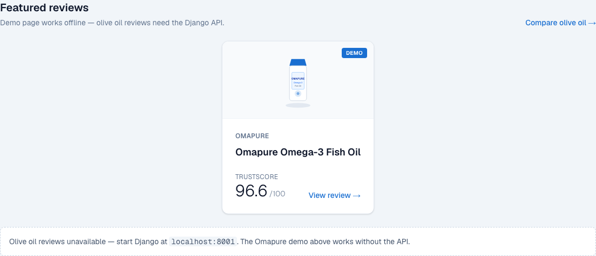
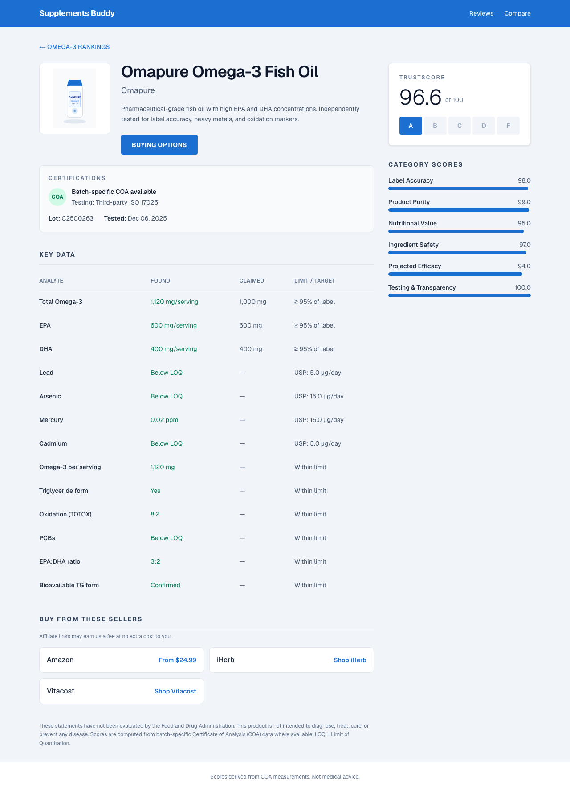

# Supplements Buddy — Frontend

Labdoor-style product review UI built with **Next.js 16**, **React 19**, **Tailwind CSS 4**, and **pnpm**. Fetches TrustScore and COA key data from `django_supplements_buddy`.

## Quick start

```bash
# Terminal 1 — Django API
cd django_supplements_buddy
docker compose up -d
uv sync
uv run python manage.py migrate
uv run python manage.py seed_olive_oil
uv run python manage.py runserver 8001

# Terminal 2 — Frontend
cd frontend_supplements_buddy
cp .env.example .env.local
pnpm install
pnpm dev
```

Open [http://localhost:3000](http://localhost:3000).

### No API? Start here

With only the frontend running, the home page shows a **centered Omapure demo card** under Featured reviews:



Open the Labdoor-style review (TrustScore, Key Data, Certifications, Buying Options):



Direct link: [http://localhost:3000/review/demo/omapure-omega-3-fish-oil](http://localhost:3000/review/demo/omapure-omega-3-fish-oil)

Regenerate screenshots after UI changes:

```bash
pnpm dev   # terminal 1
node scripts/capture-readme-screenshots.mjs   # terminal 2
```

## Compare 2 products side by side (omega-6)

Pick two supplements from search bars and view TrustScores and COA key data **next to each other** — Labdoor-style.

### Quick start (no API)

```bash
cd frontend_supplements_buddy
pnpm install
pnpm dev
```

Open [http://localhost:3000/compare/side-by-side](http://localhost:3000/compare/side-by-side).

### One-click demo example

| Product | TrustScore |
|---------|------------|
| Sunday Naturals Omega-6 GLA | 84.2 / 100 |
| NutraVita Evening Primrose Omega-6 | 78.8 / 100 |

**Direct link (both products loaded):**

[http://localhost:3000/compare/side-by-side?a=demo/demo/sunday-naturals-omega-6&b=demo/demo/nutravita-evening-primrose-omega-6](http://localhost:3000/compare/side-by-side?a=demo/demo/sunday-naturals-omega-6&b=demo/demo/nutravita-evening-primrose-omega-6)

### Step by step

1. Go to **Compare** in the header (or `/compare/side-by-side`).
2. In **Product A**, search `Sunday Naturals` and select *Sunday Naturals — Sunday Naturals Omega-6 GLA*.
3. In **Product B**, search `NutraVita` and select *NutraVita — NutraVita Evening Primrose Omega-6*.
4. Click **Compare side by side**.

You get:

- Two columns with product image, TrustScore, and category score bars
- A **KEY DATA — SIDE BY SIDE** table (e.g. Total Omega-6, GLA, mercury) aligned row by row
- Links to each product’s full review page

Individual demo reviews:

- [http://localhost:3000/review/demo/sunday-naturals-omega-6](http://localhost:3000/review/demo/sunday-naturals-omega-6)
- [http://localhost:3000/review/demo/nutravita-evening-primrose-omega-6](http://localhost:3000/review/demo/nutravita-evening-primrose-omega-6)

Olive oil brands from the API also appear in search when Django runs on `:8001`.

## Pages

| Route | Description |
|-------|-------------|
| `/` | Featured reviews + brand search |
| `/review/[brand]/[product]` | Labdoor-style review (score, key data, buying options) |
| `/compare/side-by-side` | **Dual search** — compare 2 products side by side (omega-6 demo) |
| `/compare` | Multi-brand TrustScore comparison chart (olive oil) |

### Example review URLs

- `/review/demo/omapure-omega-3-fish-oil` — **Labdoor-style demo** (static data, no API)
- `/review/olvlimits/extra-virgin-polyphenol-rich`
- `/review/getsoloio/daily-dose-evoo`
- `/review/blueprint/extra-virgin-olive-oil`

Product images live in `public/products/*.svg`.

## Labdoor-inspired layout

Each review page includes:

- **TrustScore** — 0–100 with A–F grade scale (like Labdoor Score)
- **Certifications** — lot number, test date, COA availability
- **Key Data** — analyte table (Found / Claimed / Limit)
- **Category scores** — five COA dimensions as progress bars
- **Buying Options** — official site + Amazon search CTA

## E2E tests (fast smoke check)

Runs Playwright against the dev server — **demo tests need no Django API**:

```bash
cd frontend_supplements_buddy
pnpm install
pnpm exec playwright install chromium   # first time only
pnpm test:e2e
```

What it checks:
- **review-demo** — Omapure page shows TrustScore 96.6, KEY DATA, BUYING OPTIONS
- **side-by-side-compare** — Sunday Naturals vs NutraVita omega-6 demo (no API)
- **api-integration** — olive oil reviews + compare (skipped automatically if API is down)

With Django running on `:8001`, all tests run:

```bash
# terminal 1
cd django_supplements_buddy && uv run python manage.py runserver 8001

# terminal 2
cd frontend_supplements_buddy && pnpm test:e2e
```

## Scripts

```bash
pnpm dev          # development server
pnpm build        # production build
pnpm start        # run production build
pnpm lint         # ESLint
pnpm test:e2e     # Playwright smoke tests
pnpm test:e2e:ui  # Playwright interactive UI
```
